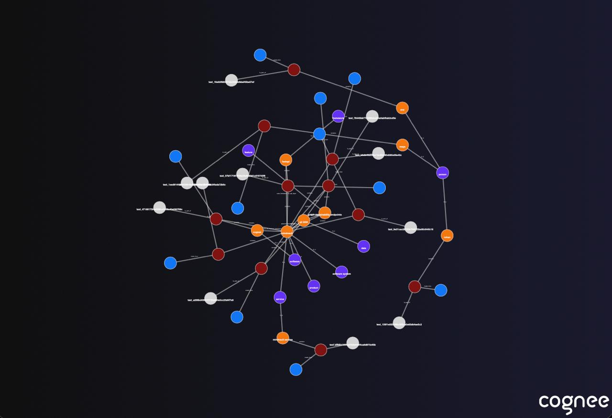

# # MindVault 🧠

A backend service that converts documents into a knowledge graph so LLMs answer questions using only stored, traceable facts — no chat history, no vector-only retrieval, no hallucinations.

---

## 🧩 Core Idea

Instead of retrieving text chunks and hoping the model reasons correctly, MindVault:

1. Extracts atomic facts from documents
2. Stores them as entities and relationships
3. Builds a knowledge graph
4. Retrieves structured facts
5. Uses an LLM only to compose answers from memory

If a fact is not stored, it cannot appear in the answer.

---

## 🌟 Why This Project Matters

Most RAG systems:
- Retrieve text chunks
- Depend on probabilistic reasoning
- Hallucinate silently

MindVault:
- Stores knowledge, not text
- Makes memory inspectable
- Guarantees answer grounding
- Scales across documents naturally

This is how LLM memory should actually be built.

---

## 🏗️ Architecture Overview

```
Document
  ↓
LLM (fact extraction)
  ↓
Validated atomic facts
  ↓
Knowledge Graph (Cognee)
  ↓
Fact retrieval
  ↓
LLM (answer generation)
```

LLMs never bypass memory.

Example knowledge graph output:



---

## 🧠 Memory Model

### Atomic Fact

The fundamental unit of memory:

Entity → Relation → Entity / Value

Example:
- LangGraph → supports → cycles
- LangChain → provides → linear chains

Each fact stores:
- subject
- relation
- object
- confidence
- source document ID

---

## ⚙️ Tech Stack

- Python: 3.11 (required)
- API: FastAPI
- LLM: OpenAI API
- Memory Engine: Cognee
- Visualization: Cognee graph visualizer (HTML)

---

## 🧾 Setup Instructions

```bash
git clone https://github.com/your-username/mindvault.git
cd mindvault

python3.11 -m venv venv
source venv/bin/activate

pip install -r requirements.txt
```

---

## 🔐 Environment Variables

Create a `.env` file in the project root:

```
LLM_API_KEY=sk-your-openai-key
DEBUG=false
```

`OPENAI_API_KEY` is also accepted for backward compatibility.

---

## 🚀 Running the Server

```bash
uvicorn app.main:app --reload
```

Open Swagger UI:

```
http://127.0.0.1:8000/docs
```

---

## 🧪 API Endpoints

### 1. Ingest a Document

`POST /ingest`

Request:

```json
{
  "document_id": "doc_langgraph",
  "title": "LangGraph Overview",
  "content": "LangGraph supports stateful workflows and allows cycles."
}
```

Response:

```json
{
  "status": "success",
  "facts_stored": 2
}
```

---

### 2. Ask a Question

`POST /query`

Request:

```json
{
  "question": "How does LangGraph differ from LangChain?"
}
```

Response:

```json
{
  "answer": "LangGraph supports stateful workflows and cycles, while LangChain focuses on linear chains.",
  "sources": ["doc_langgraph", "doc_langchain"]
}
```

---

### 3. Visualize the Knowledge Graph

`GET /graph`

- Generates an HTML file
- If `output_path` is provided, returns the HTML file directly
- If `output_path` is omitted, writes to Cognee's default location (usually your home directory)
- Displays entities and relationships visually

Optional query params:
- `output_path`: where to write the HTML file
- `dataset_name`: Cognee dataset to visualize

Example response (no `output_path`):

```json
{
  "status": "success",
  "message": "Graph written to Cognee's default location (home directory)."
}
```

Open the file in a browser to inspect memory.

---

## 🧾 Folder Structure

```
MindVault/
├── app/
│   ├── main.py        # FastAPI wiring
│   ├── settings.py    # env loading
│   ├── llm.py         # OpenAI client
│   ├── ingest.py      # document → facts
│   ├── memory.py      # Cognee integration
│   └── retrieve.py    # fact retrieval
│
├── examples/
│   ├── sample_doc.md
│   └── sample_query.txt
│
├── README.md
└── requirements.txt
```

---

## 📌 Status

- ✅ Multi-document ingestion
- ✅ Knowledge graph memory
- ✅ Grounded question answering
- ✅ Graph visualization
- ✅ Production-ready v1

---

## 🪄 License

This project is licensed under the MIT License.

You are free to use, modify, and distribute this software with attribution. See the LICENSE file for full details.

---

## 👤 Author

- Krish Batra
- Website: https://www.vybecode.in/
- Email: krishatra3@gmail.com
- LinkedIn: https://www.linkedin.com/in/krish-batra/

